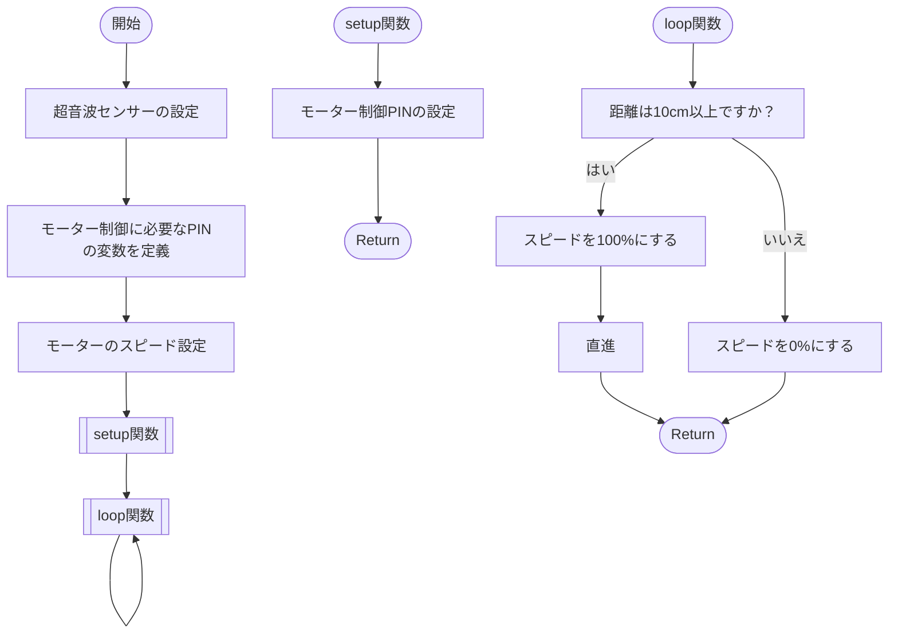

```mermaid
flowchart TB
  node_1(["開始"])
  node_2["モーター制御に必要なPINの変数を定義"]
  node_3[["setup関数"]]
  node_4[["loop関数"]]
  node_4 --> node_4
  node_13["モーターのスピード設定"]
  node_5(["setup関数"])
  node_6["モーター制御PINの設定"]
  node_8(["Return"])
  node_9(["loop関数"])
  node_16["距離は10cm以上ですか？"]
  node_20["スピードを100%にする"]
  node_21["直進"]
  node_22(["Return"])
  node_23["スピードを0%にする"]
  node_17["超音波センサーの設定"]
  node_3 --> node_4
  node_2 --> node_13
  node_5 --> node_6
  node_16 --"はい"--> node_20
  node_20 --> node_21
  node_21 --> node_22
  node_16 --"いいえ"--> node_23
  node_23 --> node_22
  node_6 --> node_8
  node_1 --> node_17
  node_17 --> node_2
  node_13 --> node_3
  node_9 --> node_16
```
