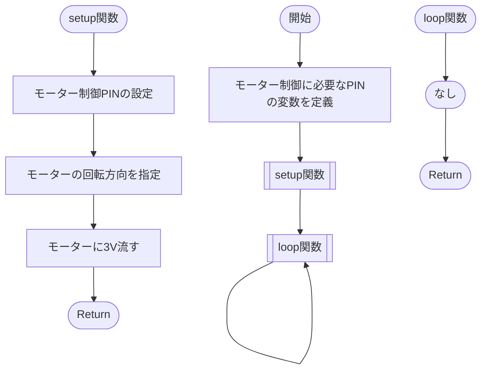

```mermaid
flowchart TB
  node_1(["開始"])
  node_2["モーター制御に必要なPINの変数を定義"]
  node_3[["setup関数"]]
  node_4[["loop関数"]]
  node_5(["setup関数"])
  node_6["モーター制御PINの設定"]
  node_7["モーターの回転方向を指定"]
  node_8["モーターに3V流す"]
  node_9(["Return"])
  node_10(["loop関数"])
  node_11(["なし"])
  node_12(["Return"])
  node_1 --> node_2
  node_2 --> node_3
  node_3 --> node_4
  node_4 --> node_4
  node_5 --> node_6
  node_6 --> node_7
  node_7 --> node_8
  node_8 --> node_9
  node_10 --> node_11
  node_11 --> node_12
```
