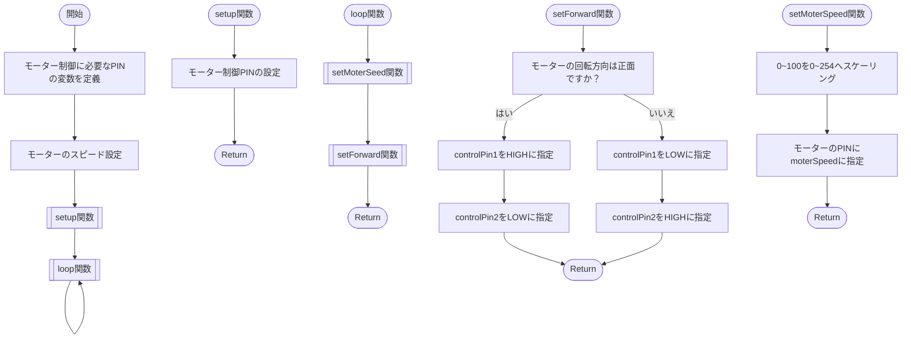

```mermaid
flowchart TB
  node_1(["開始"])
  node_2["モーター制御に必要なPINの変数を定義"]
  node_3[["setup関数"]]
  node_4[["loop関数"]]
  node_4 --> node_4
  node_13["モーターのスピード設定"]
  node_13 --> node_3
  node_5(["setup関数"])
  node_6["モーター制御PINの設定"]
  node_8(["Return"])
  node_9(["loop関数"])
  node_17(["Return"])
  node_18(["setForward関数"])
  node_19[["setForward関数"]]
  node_20(["Return"])
  node_10["モーターの回転方向は正面ですか？"]
  node_11["controlPin1をHIGHに指定"]
  node_12["controlPin1をLOWに指定"]
  node_15["controlPin2をLOWに指定"]
  node_16["controlPin2をHIGHに指定"]
  node_7[["setMoterSeed関数"]]
  node_14(["setMoterSpeed関数"])
  node_21["0~100を0~254へスケーリング"]
  node_22["モーターのPINにmoterSpeedに指定"]
  node_23(["Return"])
  node_1 --> node_2
  node_3 --> node_4
  node_2 --> node_13
  node_5 --> node_6
  node_10 --"はい"--> node_11
  node_10 --"いいえ"--> node_12
  node_11 --> node_15
  node_12 --> node_16
  node_15 --> node_17
  node_16 --> node_17
  node_18 --> node_10
  node_19 --> node_20
  node_6 --> node_8
  node_9 --> node_7
  node_7 --> node_19
  node_14 --> node_21
  node_21 --> node_22
  node_22 --> node_23
```
