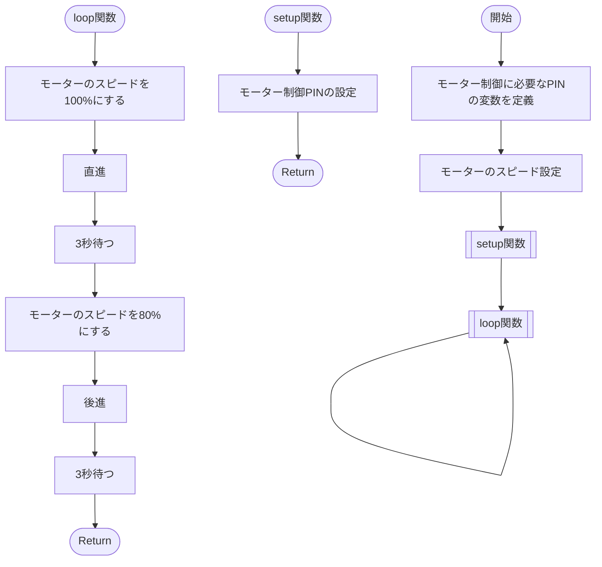

```mermaid
flowchart TB
  node_1(["開始"])
  node_2["モーター制御に必要なPINの変数を定義"]
  node_3[["setup関数"]]
  node_4[["loop関数"]]
  node_4 --> node_4
  node_13["モーターのスピード設定"]
  node_13 --> node_3
  node_5(["setup関数"])
  node_6["モーター制御PINの設定"]
  node_8(["Return"])
  node_9(["loop関数"])
  node_7["モーターのスピードを100%にする"]
  node_10["直進"]
  node_11["3秒待つ"]
  node_12["モーターのスピードを80%にする"]
  node_14["後進"]
  node_15["3秒待つ"]
  node_16(["Return"])
  node_1 --> node_2
  node_3 --> node_4
  node_2 --> node_13
  node_5 --> node_6
  node_6 --> node_8
  node_9 --> node_7
  node_7 --> node_10
  node_10 --> node_11
  node_11 --> node_12
  node_12 --> node_14
  node_14 --> node_15
  node_15 --> node_16
```
